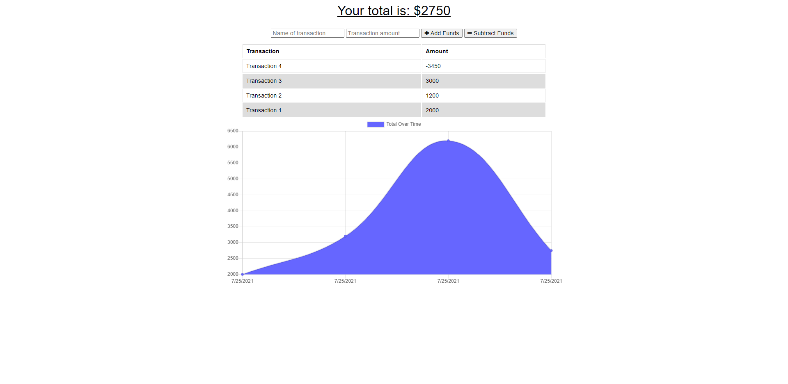

# Budget Tracker

## Table of Contents

- [Budget Tracker](#budget-tracker)
  - [Table of Contents](#table-of-contents)
  - [Description](#description)
  - [User Story](#user-story)
  - [Screenshots](#screenshots)
  - [Link to Deployed Application](#link-to-deployed-application)
  - [Link to GitHub Repository](#link-to-github-repository)

## Description

A web application that allows the user to track their transactions online or offline.

## User Story

```
AS AN avid traveller
I WANT to be able to track my withdrawals and deposits with or without a data/internet connection
SO THAT my account balance is accurate when I am traveling
```

## Screenshots

Budget Tracker


## Link to Deployed Application

You can access the link to the deployed application by clicking [here](https://afternoon-wave-16732.herokuapp.com/)

## Link to GitHub Repository

You can access the link to the deployed application by clicking [here](https://github.com/ttudorandrei/budget-tracker)
